<h3><code>sameer@github ~ $ ./contributions.sh</code></h3>

  

<table>
<tr>
<td valign="top">

</td>
<td valign="top">

</td>
</tr>
</table>

 

<h3><code>sameer@github ~ $ whoami</code></h3>

<code>AI/ML • Full Stack • GenAI • RAG • AI Agents</code>

 

 

<code>Building things with Python, React, FastAPI and AI.</code>

## 🌐 Socials:
      

# 💻 Tech Stack:
                     

# 📊 GitHub Stats:
 
 

